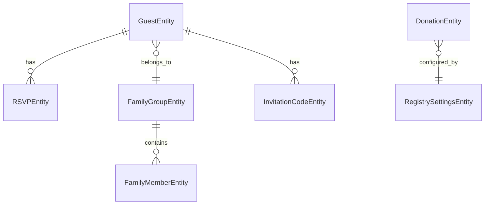

# Wedding Management System - Backend API

[](https://openjdk.org/)
[](https://spring.io/projects/spring-boot)
[](https://postgresql.org/)
[](https://railway.app/)

A comprehensive RESTful API backend for wedding management, featuring guest management, RSVP tracking, family group handling, donation processing, and automated email notifications. Built with modern Spring Boot architecture and deployed to production.

🌐 **Live Demo**: [caseylovesyas.com](https://caseylovesyas.com) | **API Docs**: [Swagger UI](https://wedding-app-backend-production.up.railway.app/swagger-ui.html)

## ✨ Key Features

### 🎯 **Core Wedding Management**
- **Guest Management**: Complete CRUD operations for wedding guests with contact information
- **Family Group Support**: Organize guests into family units with customizable attendee limits
- **RSVP System**: Comprehensive RSVP tracking with plus-one and dietary restriction support
- **Invitation Codes**: Secure, unique invitation code generation and validation

### 💌 **Communication & Notifications**
- **Asynchronous Email System**: Non-blocking email notifications with retry logic
- **Template-Based Emails**: Customizable Freemarker templates for different email types
- **Admin Notifications**: Real-time RSVP summary notifications for event organizers
- **Multi-Scenario Support**: Attending/not attending confirmations with family details

### 🎁 **Additional Features**
- **Donation Management**: Honeymoon fund tracking with payment processing integration
- **Registry Settings**: Configurable donation settings and thank you messages
- **Error Management**: Centralized error handling with custom exception types
- **Health Monitoring**: Built-in health checks and application monitoring

### 🔧 **Technical Excellence**
- **Production-Ready**: Deployed on Railway with PostgreSQL database
- **API Documentation**: Complete OpenAPI/Swagger documentation
- **Type Safety**: Full Java 17 type safety with Lombok integration
- **Testing Suite**: Comprehensive bash scripts for API testing and validation
- **CORS Configuration**: Secure cross-origin setup for frontend integration

## 🏗️ Architecture Overview

```
├── 🎛️  Controllers     → REST API endpoints with OpenAPI documentation
├── 🔧  Services        → Business logic with async email processing
├── 📊  Repositories    → JPA data access with custom queries  
├── 🏪  Entities        → JPA entities with relationship mapping
├── 📋  DTOs           → Request/response data transfer objects
├── ⚡  Configuration  → Spring configuration with async support
├── 🏷️  Annotations    → Custom annotations for API docs and retry logic
└── 📧  Templates      → Freemarker email templates
```

### Core Domain Model



## 🚀 Quick Start

### Prerequisites
- **Java 17** or higher
- **Maven 3.8+**
- **PostgreSQL 13+**
- **Docker** (optional, for local database)

### Local Development Setup

1. **Clone and navigate to the repository**
```bash
git clone https://github.com/caseythecoder90/wedding-app-backend.git
cd wedding-app-backend
```

2. **Start PostgreSQL (using Docker)**
```bash
docker-compose -f src/main/resources/docker/docker-compose.yml up -d
```

3. **Configure environment variables**
```bash
export PGHOST=localhost
export PGPORT=5432
export PGDATABASE=wedding_db
export PGUSER=wedding_user
export PGPASSWORD=wedding_password
```

4. **Build and run the application**
```bash
# Build the project
mvn clean install

# Run with local profile
mvn spring-boot:run -Dspring-boot.run.profiles=local
```

5. **Access the application**
- API Base URL: `http://localhost:8080/v1/api`
- Swagger UI: `http://localhost:8080/swagger-ui.html`
- Health Check: `http://localhost:8080/actuator/health`

## 📚 API Documentation

### Core Endpoints

| Category | Endpoint | Description |
|----------|----------|-------------|
| **Guests** | `GET/POST/PUT/DELETE /guests` | Complete guest management |
| **Family Groups** | `GET/POST/PUT/DELETE /family-groups` | Family organization and management |
| **RSVPs** | `GET/POST/PUT/DELETE /rsvps` | RSVP submission and tracking |
| **Invitations** | `GET/POST /invitations` | Invitation code generation and validation |
| **Donations** | `GET/POST/PUT /donations` | Honeymoon fund management |
| **Registry** | `GET/POST /registry` | Registry settings configuration |

### Example API Usage

**Submit an RSVP with family members:**
```bash
curl -X POST http://localhost:8080/v1/api/rsvps \
  -H "Content-Type: application/json" \
  -d '{
    "guestId": 1,
    "attending": true,
    "email": "guest@example.com",
    "dietaryRestrictions": "Vegetarian",
    "sendConfirmationEmail": true,
    "familyMembers": [
      {
        "firstName": "John",
        "lastName": "Doe", 
        "ageGroup": "adult",
        "isAttending": true,
        "dietaryRestrictions": "None"
      }
    ]
  }'
```

**Validate invitation code:**
```bash
curl -X POST http://localhost:8080/v1/api/invitations/validate \
  -H "Content-Type: application/json" \
  -d '{"code": "ABC123XYZ"}'
```

## 🧪 Testing

The project includes comprehensive bash scripts for API testing and development:

```bash
# Navigate to testing directory
cd scripts/testing

# Set up test data
./setup-guests.sh

# Generate invitation codes
./generate_invitation_codes.sh

# Test RSVP submission
./test_rsvp_submission.sh

# Test invitation validation
./test_invitation_validation.sh

# Clean up test data
./delete_guests.sh
```

**Run unit tests:**
```bash
mvn test
```

**Run specific test:**
```bash
mvn test -Dtest=RSVPControllerTest#testSubmitRSVP
```

## 🛠️ Technology Stack

### **Backend Framework**
- **Spring Boot 3.2.4** - Main application framework
- **Spring Data JPA** - Data persistence and ORM
- **Spring Web** - RESTful web services
- **Spring Mail** - Email functionality with async processing
- **Spring Retry** - Automatic retry logic for email failures

### **Database & Persistence**
- **PostgreSQL** - Primary database
- **Flyway** - Database migration management
- **HikariCP** - Connection pooling

### **Development & Documentation**
- **OpenAPI 3** - API documentation and Swagger UI
- **Lombok** - Boilerplate code reduction
- **Freemarker** - Email template engine
- **Maven** - Build and dependency management

### **Production & Deployment**
- **Railway** - Cloud deployment platform
- **Docker** - Containerization support
- **CORS** - Secure frontend integration

### **Code Quality & Utilities**
- **Apache Commons Lang** - Utility functions
- **Jackson** - JSON serialization/deserialization
- **SLF4J + Logback** - Structured logging

## 🏗️ Project Structure

```
src/main/java/com/wedding/backend/wedding_app/
├── 🎛️  controller/          # REST controllers with OpenAPI docs
├── 🔧  service/             # Business logic services
├── 📊  repository/          # JPA repositories
├── 🏪  entity/              # JPA entities
├── 📋  dto/                 # Data transfer objects
├── ⚡  config/              # Spring configuration
├── 🏷️  annotations/         # Custom annotations
├── 🔧  dao/                 # Data access objects
├── 📛  enums/               # Application enums
├── ⚠️  exception/           # Custom exceptions
└── 🛠️  util/               # Utility classes

src/main/resources/
├── 📧  templates/email/     # Freemarker email templates
├── 🐳  docker/              # Docker configuration
├── 📊  db/migration/        # Database migration scripts
├── 📋  mockdata/            # Test data files
└── ⚙️  application.yml      # Application configuration
```

## ⚙️ Configuration

### Environment Variables
```bash
# Database Configuration
PGHOST=your-db-host
PGPORT=5432
PGDATABASE=wedding_db
PGUSER=your-db-user
PGPASSWORD=your-db-password

# API Security (Optional)
WEDDING_API_KEY=your-api-key
WEDDING_API_ENABLED=false
```

### Email Configuration
The application uses Gmail SMTP with the following features:
- **Async Processing**: Non-blocking email sending
- **Retry Logic**: Automatic retry on connection failures
- **Timeout Handling**: 30-second connection timeouts
- **Template Support**: Customizable email templates

## 🚀 Deployment

### Railway Deployment
The application is configured for Railway deployment with:
- Automatic PostgreSQL provisioning
- Environment variable management
- CI/CD pipeline integration
- Production-ready configuration

### Local Docker Deployment
```bash
# Build Docker image
docker build -t wedding-app-backend .

# Run with Docker Compose
docker-compose up -d
```

## 🤝 Contributing

This is a personal portfolio project, but feedback and suggestions are welcome!

1. Fork the repository
2. Create a feature branch (`git checkout -b feature/amazing-feature`)
3. Commit your changes (`git commit -m 'Add amazing feature'`)
4. Push to the branch (`git push origin feature/amazing-feature`)
5. Open a Pull Request

## 📄 License

This project is part of my professional portfolio. Please contact me if you'd like to use any part of this code.

## 👨‍💻 About the Developer

**Casey Quinn** - Full Stack Developer

- 💼 Open to new opportunities
- 📧 Contact: [caseythecoder90@gmail.com](mailto:caseythecoder90@gmail.com)
- 🌐 Portfolio: [github.com/caseythecoder90](https://github.com/caseythecoder90)

---

*This project demonstrates proficiency in Spring Boot, RESTful API design, database management, async processing, email systems, and production deployment practices.*